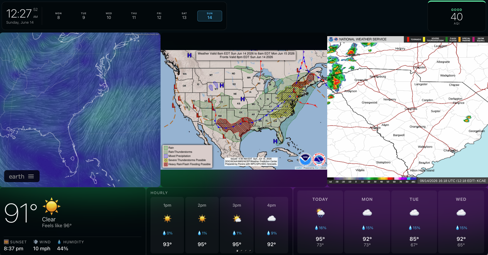
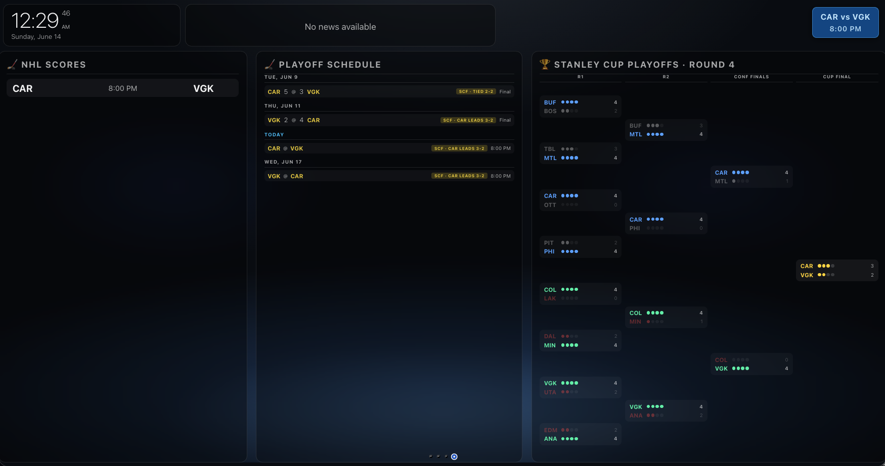
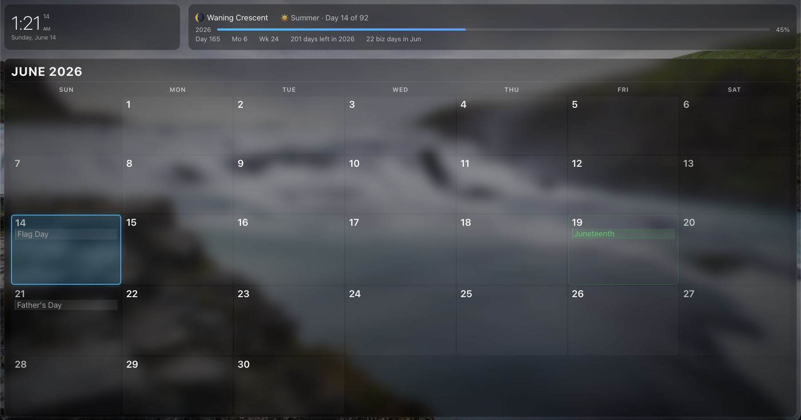
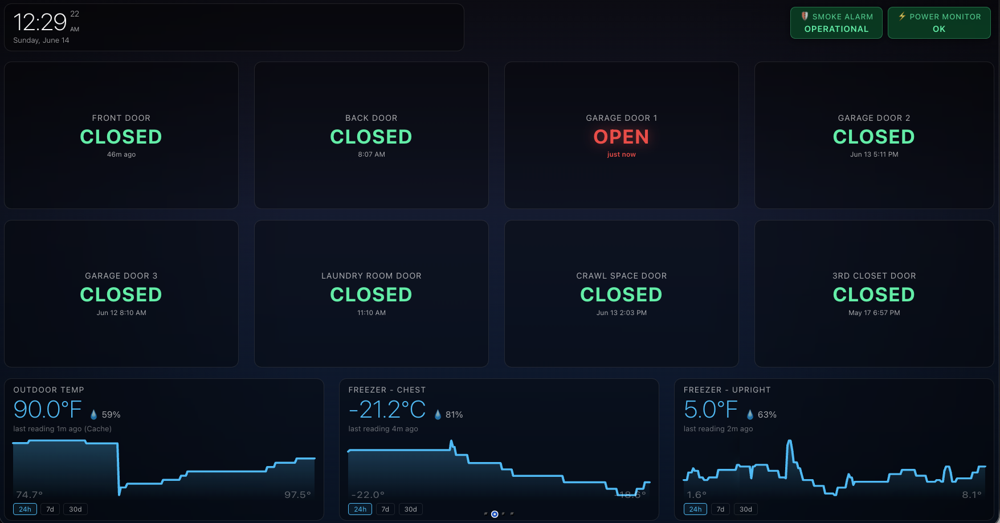
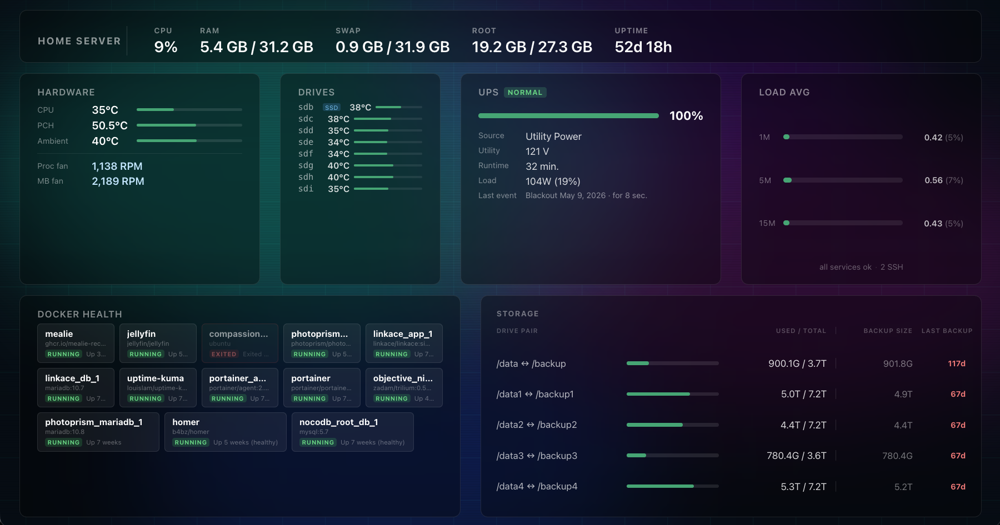

# bboard

A self-hosted, always-on dashboard for a monitor or TV — a free alternative to Dakboard. Drop it on any server, point a browser at it, and you have a living display that rotates through weather, sports, home automation, calendar, and server health. It ships with five ready-to-use screens and is built to grow — add your own custom screens by combining 30+ widgets to show exactly what you want.

The server can be anything from a Raspberry Pi to a full desktop. The display ("smart board") can be anything that runs a web browser — a computer, a Raspberry Pi with an HDMI screen, or a smart TV. Once the page is loaded, everything is managed remotely from the server: no touching the display device.

<table>
<tr>
<td></td>
<td></td>
</tr>
<tr>
<td></td>
<td></td>
</tr>
<tr>
<td colspan="2"></td>
</tr>
</table>

## What's included

**Weather** — live clock, AQI badge, NWS severe weather alerts, Nullschool wind map, radar loop, current conditions, hourly and daily forecasts, and a week-at-a-glance calendar. Powered by Open-Meteo and NWS — no API keys.

**Hockey** — live scores, playoff schedule with series status, and a full Stanley Cup bracket with conference colors. Highlights your favorite team's upcoming games. Powered by the public NHL API.

**Calendar** — full month view with federal holidays, moon phase, season tracker, year progress bar, and your own custom dates. Everything shown at a glance.

**Home** — door sensors, freezer and outdoor temperature graphs, smoke alarm status, and a YoLink alert banner. Pulls live data from [YoLink](https://shop.yosmart.com/) home automation sensors — door/window sensors, temperature and humidity sensors, smoke detectors, smart outlets, and power failure alarms.

**Server** — CPU, RAM, swap, disk, and uptime at a glance. Hardware temperatures, drive temps, UPS status, load averages, Docker container health, and storage pair usage with backup age tracking.

## Why bboard

- **No subscriptions.** All data sources are free. Weather, alerts, sports — no keys, no accounts, no monthly fees.
- **No cloud dependency.** Runs entirely on your local network. The only outbound calls are to public APIs for live data. Your home sensor data, schedule, and layout never leave your network.
- **Modular and extensible.** Add a new screen by dropping a JSON file in `screens/`. Add a widget type by writing one JS module. No build step, no framework, no boilerplate.
- **Runs on anything.** The server can be a Raspberry Pi, an old laptop, a NAS, or a full server. The display just needs a web browser — smart TV, Pi with HDMI, laptop, anything.
- **Fully remote-managed.** Once the browser is open on the display, you never touch it again. All changes — schedule, layout, backgrounds, durations — are made on the server and pushed to every connected screen automatically.
- **Hot reload.** Edit a config file and refresh the browser — no server restart needed.
- **Auto-reload.** All connected browsers reload automatically when config changes are detected on the server.
- **Page rotation.** Cycles through screens on a configurable interval. Clickable indicator dots let you jump directly to any screen.
- **Admin page.** Manage the schedule, backgrounds, durations, and screen order at `/admin` — no file editing required for day-to-day changes.
- **YoLink home automation.** First-class support for YoLink sensors: door/window, temperature, smoke, outlets, and power failure alarms. See live sensor state on the Home screen with alert banners for anything that needs attention.

## Quick start

```bash
npm install
npm start        # http://localhost:3030
npm run dev      # auto-restarts on server changes
```

Set your location and screen order in `schedule.json`, then open the browser. The admin page at `/admin` lets you adjust timings and backgrounds without touching files.

For production deployment to a Linux server (systemd, rsync, nvm), see [SERVERSETUP.md](SERVERSETUP.md).

## Integrations

| Integration | What it does | Keys required |
|-------------|-------------|--------------|
| [Open-Meteo](https://open-meteo.com/) | Weather forecast & air quality | No |
| [NWS api.weather.gov](https://www.weather.gov/documentation/services-web-api) | Severe weather alerts | No |
| [NHL API](https://api-web.nhle.com/) | Scores, schedule, playoff bracket | No |
| [Nullschool Earth](https://earth.nullschool.net/) | Wind map iframe | No |
| [Picsum Photos](https://picsum.photos/) | Rotating background images | No |
| [YoSmart / YoLink](https://shop.yosmart.com/) | Door, temp, smoke, outlet sensors | Yes (free account) |

YoLink credentials go in `.env`:

```
YOLINK_UAID=ua_xxxx
YOLINK_SECRET=sec_v1_xxxx
```

## Screens and widgets

Screens are JSON files in `screens/`. Each one declares a list of widgets positioned on a grid. There are 30+ widget types covering weather, sports, home automation, calendar, server stats, clocks, RSS feeds, countdowns, and more.

The full widget reference — types, options, positioning, backgrounds — is in [SCREENS.md](SCREENS.md).

## Security note

bboard is designed for a private LAN and is not hardened for public hosting. The proxy endpoints will fetch any URL passed to them, and there is no authentication. If you expose this to the internet, put it behind a reverse proxy with authentication and rate limiting.

## Docs

| Doc | Contents |
|-----|---------|
| [SCREENS.md](SCREENS.md) | Widget types, options, positioning, backgrounds — the full config reference |
| [SERVERSETUP.md](SERVERSETUP.md) | Production deployment, systemd service, deploy script |
| [spec.md](spec.md) | Full functional specification |
| [design.md](design.md) | Visual design guide — typography, colors, glass morphism, layout conventions |

---

Built by [Brian Bernacki](https://bernacki.me)
