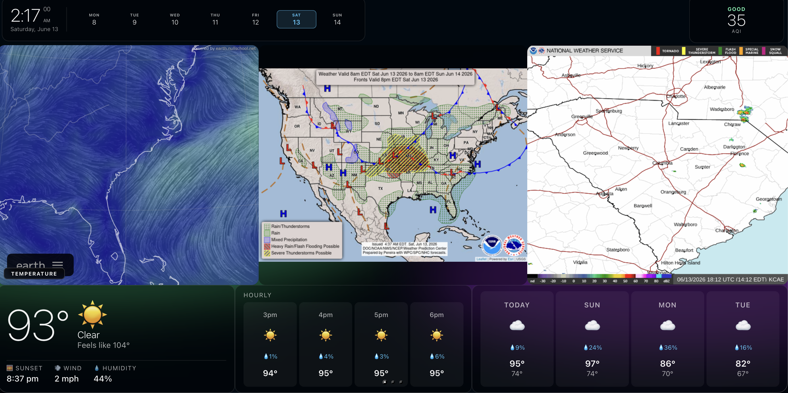

# bboard

A self-hosted dashboard for a always-on display — a free alternative to Dakboard. Built with Node.js and vanilla JS, no frameworks.



## Features

- **Weather screen** — live clock, week calendar, AQI badge, NWS alerts banner, Nullschool wind/temp/precip/humidity maps, NOAA national forecast, radar loop, current conditions, hourly and daily forecasts
- **Hockey screen** — NHL scores, playoff schedule with series status, Stanley Cup bracket
- **Calendar screen** — full month calendar with federal holidays, observances, moon phase, season tracker, year progress bar
- **Page rotation** — automatically cycles between screens on a configurable interval with indicator dots
- **Hot reload** — all JSON config files are re-read on every request; no restart needed for layout changes
- **No API keys** — uses Open-Meteo (weather/AQI), NWS (alerts), and the public NHL API, all free
- **Easily extended** — add a new screen by dropping a JSON file in `screens/`; add a new background by adding an entry to `backgrounds.json` and a CSS class

## Stack

- **Server:** Node.js + Express, port 3030
- **Frontend:** Vanilla JS ES modules, no build step
- **Config:** JSON files — edit and refresh the browser

## Getting Started

```bash
npm install
npm start        # http://localhost:3000
npm run dev      # auto-restarts on server.js changes
```

## Configuration

All layout is defined in JSON — no GUI editor needed.

| File | Purpose |
|------|---------|
| `schedule.json` | Page list: which screen, which background, how long to show, enabled/disabled |
| `screens/*.json` | Widget layout for each screen |
| `backgrounds.json` | Named background definitions |
| `data/custom-dates.json` | User-defined dates highlighted on the calendar (hot-reloaded) |

### schedule.json

```json
{
  "site": {
    "location": { "lat": 34.92, "lon": -80.74, "name": "Charlotte, NC" }
  },
  "pages": [
    { "screen": "weather",  "background": "animated-aurora", "duration": 60, "enabled": true },
    { "screen": "hockey",   "background": "hockey-night",    "duration": 60, "enabled": true },
    { "screen": "calendar", "background": "dark-slate",      "duration": 60, "enabled": true }
  ]
}
```

### Widget types

`clock` · `aqi` · `alerts` · `iframe` · `image` · `weather-current` · `weather-hourly` · `weather-daily` · `nhl-scores` · `nhl-schedule` · `nhl-bracket` · `rss` · `astro-info` · `calendar-month` · `text` · `scheduled-text` · `countdown` · `sun-times` · `gauge` · `json` · `calendar`

Each widget is positioned absolutely via a `style` block in its screen JSON:

```json
{
  "type": "weather-current",
  "id": "weather-now",
  "style": { "bottom": "0%", "left": "0%", "width": "30%", "height": "27%" }
}
```

### Backgrounds

| Name | Description |
|------|-------------|
| `animated-aurora` | Animated color blobs with blur |
| `hockey-arena` | Ice rink glow + overhead arena lights |
| `dark-slate` | Static dark gradient |
| `dark-blue` | Static dark blue gradient |
| `picsum-*` | Rotating photos from picsum.photos |

### URL parameters

| Param | Effect |
|-------|--------|
| `?screen=hockey` | Pin to a single screen, skip rotation |
| `?mockAlerts` | Show fake NWS weather alerts for testing |

## Deployment

Edit `deploy.sh` with your server details, then:

```bash
./deploy.sh                                          # rsync files to server
ssh user@host "sudo systemctl restart bboard"        # only needed after server.js changes
```

Config and frontend changes take effect on browser refresh with no restart. See `SERVERSETUP.md` for full server setup instructions.

## APIs used

All free, no keys required:

- [Open-Meteo](https://open-meteo.com/) — weather forecast and air quality
- [NWS api.weather.gov](https://www.weather.gov/documentation/services-web-api) — weather alerts
- [NHL API](https://api-web.nhle.com/) — scores, schedule, playoff bracket
- [Nullschool Earth](https://earth.nullschool.net/) — wind/temp/precip/humidity maps
- [Picsum Photos](https://picsum.photos/) — rotating background images

---

Built by [Brian Bernacki](https://bernacki.me)
